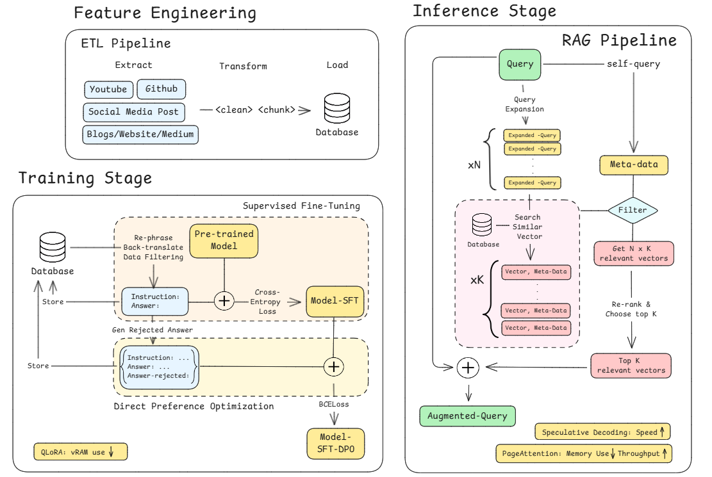

<div align="center">
  


  <h1>🚀 HermesLLM</h1>
  <p><i>Production-Ready LLM System with Advanced RAG, Training, and Deployment</i></p>
</div>

<p align="center">
  <a href="#-features">Features</a> •
  <a href="#-installation">Installation</a> •
  <a href="#-quick-start">Quick Start</a> •
  <a href="#-project-structure">Structure</a> •
  <a href="#-documentation">Documentation</a>
</p>

---

## 📖 About

HermesLLM is a production-grade LLM platform that enables end-to-end machine learning workflows from data collection to model deployment. The system ingests knowledge from multiple sources (GitHub, Medium, LinkedIn, YouTube), processes it through advanced pipelines, generates training datasets using AI, fine-tunes models with state-of-the-art techniques (LoRA, DPO), and deploys them to AWS SageMaker with comprehensive monitoring.

### 🎯 Key Capabilities

- **Multi-Source Data Collection**: Automated ingestion from LinkedIn, Medium, GitHub, YouTube, and custom sources
- **Intelligent Processing**: Advanced text cleaning, chunking (recursive, token-aware, hybrid), and embedding generation
- **Production RAG System**: Query expansion, self-query extraction, reranking, and hybrid retrieval
- **AI-Powered Datasets**: Automated generation of instruction and preference datasets using OpenAI
- **Advanced Training**: LoRA, QLoRA, DPO, ORPO fine-tuning with 4-bit quantization and Unsloth optimization
- **AWS SageMaker Integration**: Complete training, deployment, auto-scaling, and endpoint management
- **FastAPI Service**: Production-ready REST API with async endpoints
- **Comprehensive Monitoring**: Experiment tracking (Comet ML), LLM monitoring (Opik), and custom metrics
- **ZenML Orchestration**: Reproducible ML pipelines with artifact tracking and lineage
- **Infrastructure as Code**: AWS role management, endpoint deployment, auto-scaling policies
- **Testing Framework**: Comprehensive pytest suite with 100+ tests, fixtures, and mocks
- **Data Management**: Export/import tools, backup/restore, format migration (JSON/CSV/Parquet)

> [!IMPORTANT]
> This repository implements a complete LLM engineering system based on best practices from the LLM Engineer's Handbook, with significant enhancements and production-ready features.

## 🌟 Features

### 📊 Data Collection & Processing
- ✅ **Multi-Source Collectors**: LinkedIn, Medium, GitHub, YouTube, custom articles, text upload
- ✅ **Advanced Text Processing**: HTML cleaning, whitespace normalization, token-aware splitting
- ✅ **Chunking Strategies**: Recursive, sentence-aware, token-aware, hybrid multi-stage
- ✅ **Embedding Generation**: Sentence transformers with batching and GPU support
- ✅ **Vector Storage**: Qdrant integration with collection management

### 🤖 AI & Machine Learning
- ✅ **Dataset Generation**: Instruction and preference datasets using OpenAI GPT-4/3.5
- ✅ **Training Methods**: Supervised Fine-Tuning (SFT), Direct Preference Optimization (DPO), ORPO
- ✅ **Model Optimization**: LoRA, QLoRA, 4-bit quantization, Unsloth acceleration
- ✅ **Model Evaluation**: G-Eval, MMLU, GSM8K benchmarks with automated metrics
- ✅ **RAG System**: Advanced retrieval with query expansion, self-query, reranking

### ☁️ Deployment & Infrastructure
- ✅ **AWS SageMaker**: Training jobs, model deployment, endpoint management
- ✅ **Auto-Scaling**: Target tracking and step scaling policies for endpoints
- ✅ **IAM Management**: Automated role creation and policy attachment
- ✅ **Container Registry**: ECR integration for custom model images
- ✅ **FastAPI Service**: Async REST API with health checks and monitoring

### 🔧 Development & Operations
- ✅ **ZenML Pipelines**: 6 production pipelines (collection, processing, training, evaluation, deployment)
- ✅ **CLI Interface**: 20+ commands for data management, training, deployment, and queries
- ✅ **Testing Infrastructure**: pytest with 100+ tests, fixtures, mocks, coverage reporting
- ✅ **Data Management**: Export/import, backup/restore, format migration
- ✅ **Monitoring**: Comprehensive tracking with Opik, Comet ML, custom metrics

## 🗂️ Project Structure

```
HermesLLM/
├── hermes/                    # Main package
│   ├── api/                  # FastAPI REST API service
│   ├── cli/                  # Command-line interface
│   ├── collectors/           # Data collection from multiple sources
│   ├── core/                 # Core domain models (documents, chunks, embeddings)
│   ├── datasets/             # AI-powered dataset generation
│   ├── inference/            # Model inference and prediction
│   ├── infrastructure/       # AWS IAM, SageMaker, auto-scaling
│   ├── models/               # Model singletons and base classes
│   ├── pipelines/            # Data collection and processing pipelines
│   ├── processing/           # Text cleaning, chunking, embedding
│   ├── rag/                  # RAG system (retrieval, reranking, query expansion)
│   ├── storage/              # MongoDB, Qdrant, file I/O, warehouse operations
│   ├── training/             # Model training (basic, advanced, dataset builder)
│   ├── utils/                # Utilities (logging, helpers, export/import)
│   └── zenml_pipelines/      # ZenML pipeline definitions
│       └── zenml_steps/      # ZenML step implementations
├── configs/                   # YAML configuration files
├── docs/                      # Comprehensive documentation
├── examples/                  # Usage examples and tutorials
├── tests/                     # Testing infrastructure
│   ├── unit/                 # Unit tests
│   ├── integration/          # Integration tests
│   ├── conftest.py           # Global fixtures
│   ├── fixtures.py           # Test fixtures
│   └── utils.py              # Test utilities
├── workflows/                 # Workflow orchestration
├── tasks/                     # Workflow tasks
├── docker-compose.yml         # Local infrastructure
├── Dockerfile                 # Container image
└── pyproject.toml            # Poetry dependencies and configuration
```

### Package Organization

`hermes/` is the main Python package implementing all LLM functionality:

- **api/**: FastAPI application with health checks, collection, processing, and RAG endpoints
- **cli/**: Command-line interface with 20+ commands for all operations
- **collectors/**: Data ingestion from LinkedIn, Medium, GitHub, YouTube, and custom sources
- **core/**: Core domain entities (RawDocument, CleanedDocument, Chunk, EmbeddedChunk, Query)
- **datasets/**: AI-powered dataset generation using OpenAI for instruction and preference datasets
- **inference/**: Model inference with batching, caching, and async support
- **infrastructure/**: AWS infrastructure management (IAM roles, SageMaker endpoints, auto-scaling)
- **models/**: Thread-safe model singletons for embeddings and reranking
- **pipelines/**: Collection and processing pipeline orchestration
- **processing/**: Advanced text processing (cleaning, chunking, embedding)
- **rag/**: Complete RAG system with retrieval, reranking, query expansion, and self-query
- **storage/**: Data persistence (MongoDB, Qdrant, file I/O, warehouse operations)
- **training/**: Model training infrastructure (SFT, DPO, ORPO, LoRA, dataset builders)
- **utils/**: Shared utilities (logging, helpers, export/import, file I/O)
- **zenml_pipelines/** & **zenml_steps/**: ZenML pipeline and step definitions

`docs/` contains comprehensive documentation for all major features and workflows.

`examples/` provides practical usage examples for all major features.

`tests/` includes a complete testing infrastructure with pytest configuration, fixtures, and utilities.

## 💻 Installation

> [!NOTE]
> If you encounter any issues during installation, please check the [Issues](https://github.com/yourusername/HermesLLM/issues) section or open a new issue for support.

### 📋 Prerequisites

| Tool | Version | Purpose | Installation Link |
|------|---------|---------|------------------|
| Python | 3.11 | Runtime environment | [Download](https://www.python.org/downloads/) |
| Poetry | ≥1.8.3 and <2.0 | Package management | [Install Guide](https://python-poetry.org/docs/#installation) |
| Docker | ≥27.1.1 | Containerization (for local databases) | [Install Guide](https://docs.docker.com/engine/install/) |
| AWS CLI | ≥2.15.42 | Cloud management (optional) | [Install Guide](https://docs.aws.amazon.com/cli/latest/userguide/getting-started-install.html) |
| Git | Latest | Version control | [Download](https://git-scm.com/downloads) |

### Cloud Services (Optional)

The project can integrate with the following cloud services:

| Service | Purpose | Required |
|---------|---------|----------|
| [OpenAI](https://openai.com/) | Dataset generation, RAG LLM | Yes (for AI features) |
| [Hugging Face](https://huggingface.co/) | Model registry | Recommended |
| [Comet ML](https://www.comet.com/) | Experiment tracking | Optional |
| [Opik](https://www.comet.com/site/products/opik/) | LLM monitoring | Optional |
| [ZenML](https://www.zenml.io/) | Pipeline orchestration | Optional |
| [AWS](https://aws.amazon.com/) | SageMaker training/deployment | Optional |
| [MongoDB](https://www.mongodb.com/) | Document database | Local or Cloud |
| [Qdrant](https://qdrant.tech/) | Vector database | Local or Cloud |

### 🚀 Installation Steps

#### 1. Clone the Repository

```bash
git clone https://github.com/yourusername/HermesLLM.git
cd HermesLLM
```

#### 2. Set Up Python Environment

Verify Python 3.11 is installed:

```bash
python --version  # Should show Python 3.11.x
```

If using pyenv (recommended):

```bash
pyenv install 3.11.8
pyenv local 3.11.8
```

#### 3. Install Dependencies

```bash
# Configure Poetry to use Python 3.11
poetry env use 3.11

# Install all dependencies
poetry install

# Install with cloud support (AWS, etc.)
poetry install --with cloud

# Set up pre-commit hooks (optional)
poetry run pre-commit install
```

#### 4. Configure Environment Variables

Create a `.env` file with your credentials:

```bash
cp .env.example .env
```

Edit `.env` with your settings:

```env
# === Required for AI Features ===
OPENAI_API_KEY=your_openai_key

# === Database Configuration ===
# MongoDB (local by default)
DATABASE_HOST=mongodb://localhost:27017
DATABASE_NAME=hermes

# Qdrant (local by default)
USE_QDRANT_CLOUD=false
QDRANT_DATABASE_HOST=localhost
QDRANT_DATABASE_PORT=6333

# === Optional: Cloud Services ===
HUGGINGFACE_ACCESS_TOKEN=your_hf_token
COMET_API_KEY=your_comet_key

# === Optional: AWS Configuration ===
AWS_REGION=us-east-1
AWS_ACCESS_KEY_ID=your_aws_key
AWS_SECRET_ACCESS_KEY=your_aws_secret

# === Model Configuration ===
EMBEDDING_MODEL_ID=sentence-transformers/all-MiniLM-L6-v2
RERANKING_MODEL_ID=cross-encoder/ms-marco-MiniLM-L-6-v2
OPENAI_MODEL_ID=gpt-3.5-turbo
```

> [!TIP]
> **Authentication Tutorials:**
> - [OpenAI API Key](https://platform.openai.com/docs/quickstart)
> - [Hugging Face Token](https://huggingface.co/docs/hub/en/security-tokens)
> - [Comet ML / Opik Setup](https://www.comet.com/docs/opik/)
> - [AWS Credentials](https://docs.aws.amazon.com/cli/latest/userguide/cli-configure-files.html)

#### 5. Start Local Infrastructure

Start MongoDB and Qdrant using Docker:

```bash
# Start all services
docker-compose up -d

# Verify services are running
docker-compose ps
```

Services will be available at:
- MongoDB: `mongodb://localhost:27017`
- Qdrant: `http://localhost:6333`

To stop the services:

```bash
docker-compose down
```

> [!WARNING]
> On MacOS, if you encounter fork safety issues with ZenML, export this environment variable:
> ```bash
> export OBJC_DISABLE_INITIALIZE_FORK_SAFETY=YES
> ```

#### 6. Activate Poetry Environment

```bash
# Activate the virtual environment
poetry shell

# Verify installation
python -c "import hermes; print('HermesLLM installed successfully!')"
```

### 🐳 Docker Installation (Alternative)

Run the entire system in Docker:

```bash
# Build the image
docker build -t hermes-llm .

# Run with docker-compose
docker-compose up -d

# Execute commands in container
docker-compose exec hermes hermes --help
```

## 🎯 Quick Start

### 1. Collect Data from Sources

```bash
# Collect from Medium
hermes collect \
  https://medium.com/@user/article-1 \
  https://medium.com/@user/article-2 \
  -u user123 -n "John Doe"

# Check system status
hermes status
```

**Python API:**

```python
from hermes.pipelines.collection import collection_pipeline

# Collect from multiple sources
stats = collection_pipeline(
    user_id="user123",
    full_name="John Doe",
    links=[
        "https://medium.com/@user/article",
        "https://github.com/user/repo",
        "https://www.youtube.com/watch?v=VIDEO_ID"
    ]
)

print(f"Collected: {stats['success']}/{stats['total']}")
```

### 2. Process and Embed Documents

```bash
# Process all documents
hermes process --chunk-size 500

# Process with filters
hermes process --author-id user123 --limit 100
```

**Python API:**

```python
from hermes.pipelines.processing import processing_pipeline

# Run processing pipeline
stats = processing_pipeline(
    author_id="user123",
    chunk_size=500,
    embedding_model="sentence-transformers/all-MiniLM-L6-v2"
)

print(f"Processed {stats['total']} documents")
print(f"Stored {stats['stored']} vectors")
```

### 3. Generate Training Datasets

**Using Python:**

```python
from hermes.datasets import InstructDatasetGenerator
from hermes.core.documents import CleanedDocument

# Load your documents
documents = CleanedDocument.bulk_find(limit=50)

# Generate instruction dataset
generator = InstructDatasetGenerator(
    model="gpt-4",
    num_samples=100
)

dataset = generator.generate_dataset(documents)

# Save to Hugging Face
dataset.push_to_hub("username/my-instruction-dataset")
```

**Using ZenML Pipeline:**

```python
from hermes.zenml_pipelines.dataset_generation import dataset_generation_pipeline

# Generate datasets
dataset_generation_pipeline(
    dataset_name="my-instruction-dataset",
    num_samples=100,
    model="gpt-4"
)
```

### 4. Train Your Model

**Basic SFT Training:**

```python
from hermes.training import LLMTrainer, TrainingConfig

# Configure training
config = TrainingConfig(
    model_name="meta-llama/Llama-3.2-1B",
    output_dir="models/my-model",
    dataset_path="username/my-instruction-dataset",
    num_train_epochs=3,
)

# Train
trainer = LLMTrainer(config)
metrics = trainer.train()
```

**Advanced Training with LoRA:**

```python
from hermes.training.advanced import AdvancedTrainingConfig, AdvancedLLMTrainer

# Configure LoRA training
config = AdvancedTrainingConfig(
    model_name="meta-llama/Llama-3.2-1B",
    output_dir="models/my-lora-model",
    dataset_path="username/my-instruction-dataset",
    use_lora=True,
    lora_r=16,
    lora_alpha=32,
    load_in_4bit=True,  # QLoRA
    use_unsloth=True,   # Speed optimization
    num_train_epochs=3,
)

trainer = AdvancedLLMTrainer(config)
metrics = trainer.train()
```

**Using ZenML Pipeline:**

```python
from hermes.zenml_pipelines.training import sft_training_pipeline

# Run training pipeline
sft_training_pipeline(
    dataset_path="username/my-dataset",
    model_name="meta-llama/Llama-3.2-1B",
    output_dir="models/my-model",
    num_epochs=3
)
```

### 5. Deploy to AWS SageMaker

**Deploy Model:**

```python
from hermes.infrastructure import SageMakerEndpointManager, AutoScalingManager

# Deploy endpoint
endpoint_manager = SageMakerEndpointManager(
    region="us-east-1",
    role_arn="arn:aws:iam::123456789012:role/SageMakerRole"
)

endpoint_name = endpoint_manager.deploy_model(
    model_name="my-llm-model",
    model_path="s3://my-bucket/models/my-model",
    instance_type="ml.g5.2xlarge",
    instance_count=1
)

# Configure auto-scaling
autoscaling = AutoScalingManager(region="us-east-1")
autoscaling.setup_basic_autoscaling(
    endpoint_name=endpoint_name,
    variant_name="AllTraffic",
    min_capacity=1,
    max_capacity=4,
    target_value=70.0  # Target 70% GPU utilization
)
```

**Using ZenML Pipeline:**

```python
from hermes.zenml_pipelines.deployment import sagemaker_deployment_pipeline

sagemaker_deployment_pipeline(
    model_path="models/my-model",
    model_name="my-llm-model",
    role_arn="arn:aws:iam::123456789012:role/SageMakerRole",
    s3_bucket="my-sagemaker-bucket",
    instance_type="ml.g5.2xlarge"
)
```

### 6. Run RAG Queries

**CLI:**

```bash
# Query the RAG system
hermes query "How do I implement a RAG system?"

# With query expansion
hermes query "Explain vector databases" --expand --k 5
```

**Python API:**

```python
from hermes.rag import RAGPipeline

# Initialize RAG
rag = RAGPipeline(
    use_reranking=True,
    use_query_expansion=True
)

# Query
result = rag.query(
    query="Explain how to fine-tune LLMs",
    top_k=5
)

print("Answer:", result.answer)
print("Sources:", result.sources)
```

**REST API:**

```bash
# Start API server
hermes serve --port 8000

# Query endpoint
curl -X POST http://localhost:8000/rag \
  -H "Content-Type: application/json" \
  -d '{
    "query": "How to implement RAG systems?",
    "use_query_expansion": true,
    "top_k": 5
  }'
```

### 7. Export and Backup Data

```bash
# Export collections
hermes export --collection raw_documents --format json --output-dir exports/

# Create backup
hermes backup --backup-dir backups/$(date +%Y%m%d) --format parquet

# Restore from backup
hermes restore --backup-dir backups/20240121 --confirm

# Migrate formats
hermes migrate \
  --source-dir exports/ \
  --target-dir parquet/ \
  --source-format json \
  --target-format parquet
```

## 📚 Documentation

Comprehensive documentation is available in the [`docs/`](docs/) directory:

| Document | Description |
|----------|-------------|
| [RAG.md](docs/RAG.md) | Complete RAG system guide (retrieval, reranking, query expansion) |
| [TRAINING.md](docs/TRAINING.md) | Training documentation (SFT, DPO, ORPO, LoRA, QLoRA) |
| [DATASETS.md](docs/DATASETS.md) | AI-powered dataset generation guide |
| [INFRASTRUCTURE.md](docs/INFRASTRUCTURE.md) | AWS SageMaker deployment and infrastructure |
| [ZENML.md](docs/ZENML.md) | ZenML pipeline orchestration guide |
| [MONITORING.md](docs/MONITORING.md) | Monitoring and experiment tracking |
| [TESTING.md](docs/TESTING.md) | Testing infrastructure and best practices |
| [EXPORT_IMPORT.md](docs/EXPORT_IMPORT.md) | Data export/import and backup strategies |
| [CLI.md](docs/CLI.md) | Complete CLI reference |
| [API.md](docs/API.md) | REST API documentation |

### Example Code

Practical examples are in the [`examples/`](examples/) directory:

- `collection_pipeline_example.py` - Data collection from multiple sources
- `processing_pipeline_example.py` - Document processing and embedding
- `generate_datasets_example.py` - AI-powered dataset generation
- `training_example.py` - Basic model training
- `advanced_training_example.py` - LoRA/DPO/ORPO training
- `sagemaker_deployment_example.py` - AWS deployment
- `rag_example.py` - RAG system usage
- `zenml_pipelines_example.py` - Complete ZenML workflows
- `infrastructure_examples.py` - AWS infrastructure management

## 🛠️ Configuration

### Configuration Files

YAML configuration files in [`configs/`](configs/):

```yaml
# configs/data_collection.yaml
data_sources:
  medium:
    enabled: true
    author_id: "your_author_id"
  github:
    enabled: true
    username: "your_username"
  youtube:
    enabled: true
    channel_id: "your_channel_id"

processing:
  chunk_size: 500
  chunk_overlap: 50
  embedding_model: "sentence-transformers/all-MiniLM-L6-v2"
```

### Environment Variables

All configuration can be set via environment variables in `.env`:

```env
# === Core Settings ===
DATABASE_NAME=hermes
EMBEDDING_MODEL_ID=sentence-transformers/all-MiniLM-L6-v2
OPENAI_MODEL_ID=gpt-3.5-turbo

# === MongoDB ===
DATABASE_HOST=mongodb://localhost:27017

# === Qdrant ===
USE_QDRANT_CLOUD=false
QDRANT_DATABASE_HOST=localhost
QDRANT_DATABASE_PORT=6333
QDRANT_CLOUD_URL=  # For cloud deployment
QDRANT_APIKEY=     # For cloud deployment

# === API Keys ===
OPENAI_API_KEY=your_key
HUGGINGFACE_ACCESS_TOKEN=your_token
COMET_API_KEY=your_key

# === AWS (Optional) ===
AWS_REGION=us-east-1
AWS_ACCESS_KEY_ID=your_key
AWS_SECRET_ACCESS_KEY=your_secret
SAGEMAKER_ROLE_ARN=arn:aws:iam::123456789012:role/SageMakerRole

# === Training ===
USE_FLASH_ATTENTION=true
TRAINING_MAX_SEQ_LENGTH=2048

# === Monitoring ===
ENABLE_OPIK_TRACKING=true
```

## 📖 Usage Examples

### Complete RAG Workflow

```python
from hermes.pipelines.collection import collection_pipeline
from hermes.pipelines.processing import processing_pipeline
from hermes.rag import RAGPipeline

# 1. Collect data
collection_pipeline(
    user_id="user123",
    full_name="John Doe",
    links=["https://medium.com/@user/article"]
)

# 2. Process documents
processing_pipeline(author_id="user123")

# 3. Query with RAG
rag = RAGPipeline(use_reranking=True)
result = rag.query("How to build RAG systems?")
print(result.answer)
```

### End-to-End Training Pipeline

```python
from hermes.datasets import InstructDatasetGenerator
from hermes.training.advanced import AdvancedLLMTrainer, AdvancedTrainingConfig
from hermes.core.documents import CleanedDocument

# 1. Generate training dataset
documents = CleanedDocument.bulk_find(limit=100)
generator = InstructDatasetGenerator()
dataset = generator.generate_dataset(documents, num_samples=100)
dataset.push_to_hub("username/my-dataset")

# 2. Train with LoRA
config = AdvancedTrainingConfig(
    model_name="meta-llama/Llama-3.2-1B",
    dataset_path="username/my-dataset",
    output_dir="models/my-model",
    use_lora=True,
    load_in_4bit=True,
    num_train_epochs=3
)

trainer = AdvancedLLMTrainer(config)
metrics = trainer.train()
print(f"Training completed. Final loss: {metrics['train_loss']}")
```

### AWS SageMaker Deployment

```python
from hermes.infrastructure import (
    create_sagemaker_execution_role,
    SageMakerEndpointManager,
    AutoScalingManager
)

# 1. Create IAM role (if needed)
role_arn = create_sagemaker_execution_role(
    role_name="HermesSageMakerRole",
    account_id="123456789012"
)

# 2. Deploy model
endpoint_manager = SageMakerEndpointManager(
    region="us-east-1",
    role_arn=role_arn
)

endpoint = endpoint_manager.deploy_model(
    model_name="my-llm",
    model_path="s3://bucket/models/my-model",
    instance_type="ml.g5.2xlarge"
)

# 3. Setup auto-scaling
autoscaling = AutoScalingManager(region="us-east-1")
autoscaling.setup_basic_autoscaling(
    endpoint_name=endpoint,
    min_capacity=1,
    max_capacity=4,
    target_value=70.0
)

print(f"Endpoint deployed: {endpoint}")
```

### Data Backup and Migration

```python
from hermes.storage.warehouse import DataWarehouseManager

manager = DataWarehouseManager()

# Create backup
backup_files = manager.backup(
    backup_dir="backups/2024-01-21",
    file_format="parquet"
)

# Migrate to different format
manager.migrate(
    source_dir="backups/2024-01-21",
    target_dir="exports/json",
    source_format="parquet",
    target_format="json"
)

# Restore if needed
manager.restore(
    backup_dir="backups/2024-01-21",
    file_format="parquet"
)
```

## 🧪 Testing

```bash
# Run all tests
poetry run pytest

# Run with coverage
poetry run pytest --cov=hermes --cov-report=html

# Run specific test suite
poetry run pytest tests/unit/
poetry run pytest tests/integration/

# Run by marker
poetry run pytest -m unit
poetry run pytest -m "not slow"

# Run specific test
poetry run pytest tests/unit/test_models.py::test_create_raw_document
```

### Test Structure

```
tests/
├── conftest.py           # Global fixtures
├── fixtures.py           # Reusable fixtures
├── utils.py              # Test utilities
├── unit/                 # Unit tests
│   ├── test_models.py
│   ├── test_processing.py
│   ├── test_storage.py
│   └── test_utils.py
└── integration/          # Integration tests
    ├── test_pipelines.py
    └── test_workflows.py
```

See [TESTING.md](docs/TESTING.md) for comprehensive testing guide.

## 🐳 Docker

### Using Docker Compose

```bash
# Start all services (MongoDB, Qdrant, API)
docker-compose up -d

# View logs
docker-compose logs -f

# Execute commands
docker-compose exec hermes hermes status
docker-compose exec hermes hermes collect --help

# Stop services
docker-compose down

# Stop and remove volumes
docker-compose down -v
```

### Building Custom Image

```bash
# Build image
docker build -t hermes-llm:latest .

# Run container
docker run -d \
  --name hermes \
  -p 8000:8000 \
  -v $(pwd)/models:/app/models \
  -v $(pwd)/data:/app/data \
  --env-file .env \
  hermes-llm:latest

# Execute commands in container
docker exec hermes hermes status
```

## 📊 Monitoring

### Experiment Tracking

The system integrates with multiple monitoring platforms:

**Comet ML** (Training Experiments):
```python
from hermes.training import LLMTrainer

# Automatically logs to Comet ML when COMET_API_KEY is set
trainer = LLMTrainer(config)
metrics = trainer.train()  # Logs metrics, hyperparameters, artifacts
```

**Opik** (LLM Monitoring):
```python
from hermes.rag import RAGPipeline

# Automatically tracks prompts, responses, latency when enabled
rag = RAGPipeline()  # Set ENABLE_OPIK_TRACKING=true in .env
result = rag.query("Your question")
```

**ZenML** (Pipeline Tracking):
```python
from hermes.zenml_pipelines import sft_training_pipeline

# Tracks pipeline runs, artifacts, lineage
sft_training_pipeline(
    dataset_path="username/dataset",
    model_name="meta-llama/Llama-3.2-1B"
)
# View in ZenML Dashboard: http://localhost:8237
```

### Custom Metrics

```python
from hermes.utils.logging import setup_logging
from loguru import logger

setup_logging(level="INFO")
logger.info("Custom metric", extra={"accuracy": 0.95, "loss": 0.05})
```

## 🤝 Contributing

Contributions are welcome! Please follow these steps:

1. **Fork the repository**
2. **Create a feature branch**: `git checkout -b feature/amazing-feature`
3. **Make your changes**
4. **Run tests**: `poetry run pytest`
5. **Run linting**: `poetry run pre-commit run --all-files`
6. **Commit changes**: `git commit -m 'Add amazing feature'`
7. **Push to branch**: `git push origin feature/amazing-feature`
8. **Open a Pull Request**

### Development Guidelines

- Follow PEP 8 style guide
- Write tests for new features
- Update documentation
- Add type hints
- Use loguru for logging

## 📄 License

This project is licensed under the MIT License - see the [LICENSE](LICENSE) file for details.

## 🙏 Acknowledgments

- Based on concepts from the [LLM Engineer's Handbook](https://www.amazon.com/LLM-Engineers-Handbook-engineering-production/dp/1836200072/) by Paul Iusztin and Maxime Labonne
- Built with [ZenML](https://zenml.io/), [LangChain](https://python.langchain.com/), [Hugging Face](https://huggingface.co/), and [AWS SageMaker](https://aws.amazon.com/sagemaker/)
- Community contributions and feedback

## 📞 Support

- **Issues**: [GitHub Issues](https://github.com/yourusername/HermesLLM/issues)
- **Discussions**: [GitHub Discussions](https://github.com/yourusername/HermesLLM/discussions)
- **Documentation**: [docs/](docs/)

---

<div align="center">
  <p>⭐ Star this repo if you find it useful!</p>
  <p>Made with ❤️ for the LLM community</p>
</div>